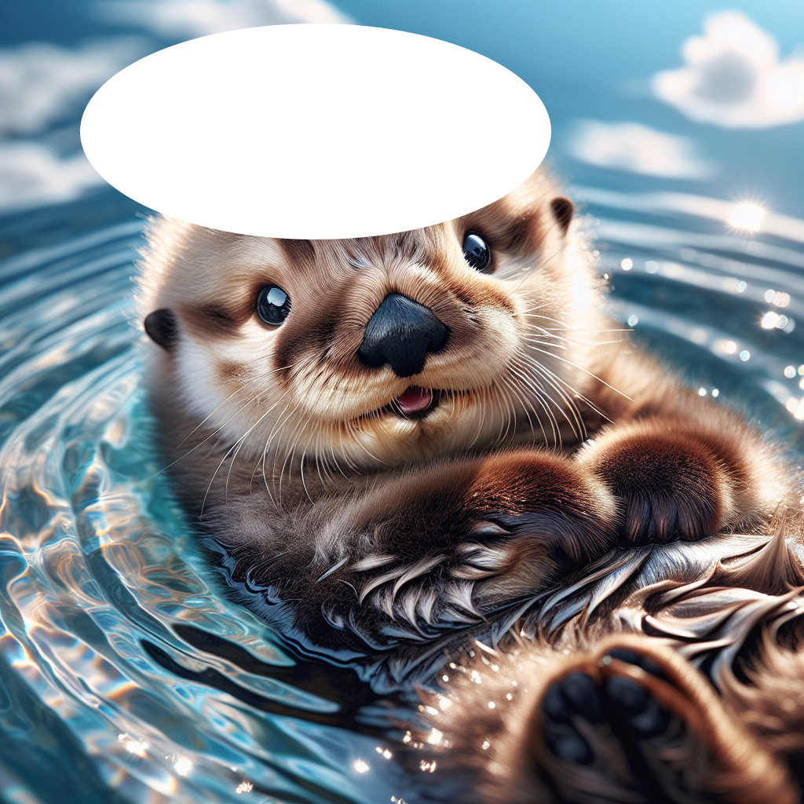

# OpenAI Endpoints Images

API: <https://platform.openai.com/docs/api-reference/images>

각 코드의 실행은 해당 디렉토리에서 다음과 같이 실행합니다.

```bash
python {실행하고자 하는 파일 이름}
```

## 이미지 생성

`create_image.py`: 이미지를 생성합니다. 이미지를 생성하기 위해 프롬프트(텍스트)를 입력합니다.

결과: 새롭게 생성된 이미지가 'baby_sea_otter.png'로 저장됩니다.

```text
https://oaidalleapiprodscus.blob.core.windows.net/...
```

## 이미지 편집 생성

`edit_image.py`: 이미지를 편집하여 생성합니다.

- 2개의 이미지가 필요합니다. (또는 투명한 부분이 있는 1개의 이미지)
- `otter.png`: 편집 하고자 하는 이미지 입니다.


- `mask.png`: 편집하고자 하는 영역을 투명하게 만든 이미지 입니다.



결과: `mask.png`의 투명한 부분에 예쁜 베레모가 생겼습니다.


## 이미지 변형 생성

`create_image_variation.py`: 이미지를 변형하여 생성합니다. 프롬프트를 줄 수 없습니다. `n=2`로 설정하여 2개의 이미지를 생성합니다.

결과: 새롭게 생성된 이미지가 'baby_sea_otter_variation.png'로 저장됩니다.

```text
변형된 2개의 이미지가 생성 되었습니다.
```
